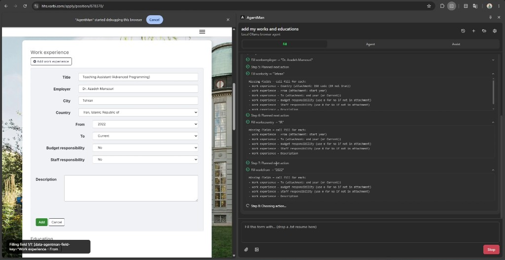
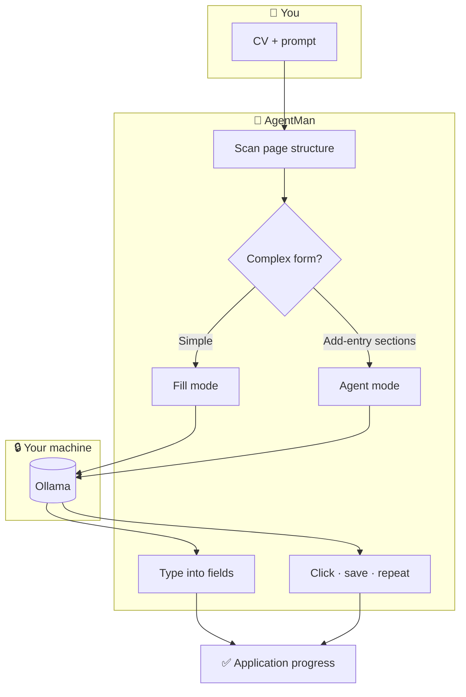

<div align="center">

<h1 align="center">
  
  &nbsp;AgentMan
</h1>

### Your résumé. Any application form. Filled locally in minutes — not hours.

**The Chrome extension that turns Ollama into a private form-filling assistant.**  
Attach your CV once. AgentMan reads the page, maps your experience to real fields, and handles the “Add work experience” loops other tools ignore.

<br />

[](https://www.google.com/chrome/)
[](https://ollama.com)
[]()
[]()
[]()

<br />

**No API keys · No cloud upload · No monthly fee**

[Get started](#-get-started-in-3-minutes) · [See it in action](#-see-it-in-action) · [Features](#-what-you-get) · [Compare](#-agentman-vs-the-alternatives) · [Developers](#-developers)

<br />

</div>

---

## See it in action

<div align="center">

<a href="docs/screenshots/agentman-demo.png">
  
</a>

<br /><br />

**Attach your CV. Open a real application portal. Watch AgentMan work.**

Left: a live **Work experience** form (Title, Employer, City, Country, dates, responsibilities).  
Right: the **AgentMan side panel** — Fill mode, step-by-step tool log, missing-field hints, and your prompt with attachments.

*No mockup. Local Ollama. Your data stays on your machine.*

</div>

---

## The problem

Job applications and enterprise portals are designed to waste your time.

| Pain | What it costs you |
|:--|:--|
| **Copy-paste loops** | Same employer, city, dates — typed 20× per application |
| **“Add entry” forms** | Work history × 7, education × 3 — each with its own modal and Save button |
| **Cloud AI workarounds** | Paste CV into ChatGPT, copy answers back, hope field names match |
| **Browser autofill limits** | Saves your name and email — not your thesis title or budget responsibility |
| **Privacy anxiety** | Uploading a résumé to someone else’s server for every form |

**The market gap:** tools are either *dumb autofill* or *cloud AI chat*. Neither fills a **complex, multi-step application** from **your documents** while **keeping everything on your machine**.

---

## The solution

**AgentMan closes that gap.**

It sits in your Chrome side panel, connects to **Ollama on your PC**, and treats form filling like a product workflow — not a chat experiment.

1. **You** attach a CV or write a short instruction.  
2. **AgentMan** scans the live page (fields, dropdowns, Add buttons, saved entries).  
3. **Your local model** decides what goes where — one field at a time when it matters.  
4. **The extension** types values in, clicks through sections, auto-saves entries, and moves to the next row.

You stay in control. You see every step. Your data never leaves your network.

---

## What you get

### ⚡ Fill mode — speed for simple forms

One prompt → mapped fields → visible typing animation.  
Perfect for contact pages, short surveys, and single-page applications.

### 🎯 Agent mode — power for real applications

Multi-step automation: open section → fill → save → next entry.  
Built for Varbi-style portals, expense reports, and repeatable “Add” workflows.

### 👁 Assist mode — clarity before you commit

Summarize long job posts and form instructions with vision-capable models.  
Know what you’re applying to before you fill.

<br />

| Capability | Business value |
|:--|:--|
| **CV & file attachments** | One source of truth — no re-explaining your background every time |
| **Smart field aliases** | `work:title`, `edu:country` — models speak the form’s language |
| **Add-entry automation** | Seven jobs on your résumé → seven saved rows, not seven manual sessions |
| **Live activity log** | Watch clicks and fills — trust, audit, intervene |
| **Snippets & chat history** | Reuse winning prompts across applications |
| **Dark mode side panel** | `Alt+Shift+A` — always one shortcut away |

---

## AgentMan vs the alternatives

|  | Browser autofill | Cloud AI (ChatGPT, etc.) | **AgentMan** |
|:--|:--:|:--:|:--:|
| Fills custom application portals | ❌ | ⚠️ Manual copy-paste | ✅ |
| Multi-step “Add work experience” | ❌ | ❌ | ✅ |
| Uses your CV as context | ❌ | ⚠️ Upload to their cloud | ✅ Local files |
| Data stays on your machine | ✅ | ❌ | ✅ |
| Sees actual page fields | ✅ | ❌ | ✅ |
| Subscription / API cost | Free | $20+/mo typical | **Free** (Ollama) |
| Visible automation steps | — | — | ✅ |

**Bottom line:** AgentMan is for people who apply seriously and care where their résumé goes.

---

## Who this is for

| Persona | Use case |
|:--|:--|
| **Job seekers** | Blast through 50 similar applications without 50× typing |
| **Students & researchers** | Grant portals, university systems, fellowship forms |
| **Privacy-conscious professionals** | Legal, healthcare, finance — local inference only |
| **Power users & builders** | Open codebase, Ollama stack, extensible agent tools |

---

## How it works

<div align="center">



</div>

> **Simple forms** → fast fill. **Add-entry sections** → agent takes over automatically. You don’t switch modes manually for most job sites.

---

## Get started in 3 minutes

### Step 1 — Prerequisites

| Need | Link |
|:--|:--|
| Chrome | [google.com/chrome](https://www.google.com/chrome/) |
| Ollama | [ollama.com/download](https://ollama.com/download) |
| Yarn | [yarnpkg.com](https://yarnpkg.com/) |

### Step 2 — Install

```bash
git clone https://github.com/YOUR_USERNAME/agentman.git
cd agentman
yarn install
yarn dev
```

Chrome → `chrome://extensions` → **Developer mode** → **Load unpacked** → `build/chrome-mv3-dev`

### Step 3 — Run Ollama

```bash
ollama serve
ollama pull qwen2.5:7b
ollama pull qwen2.5:14b
```

### Step 4 — First win

1. Press **`Alt+Shift+A`** to open AgentMan  
2. **Settings** → Test Ollama → assign models  
3. Open a form → attach your CV → type: *“Add my work experience and education from the attachment”*  
4. Watch the side panel — approve as it works  

<div align="center">

**That’s it. Your first local AI form assistant — no signup wall.**

</div>

---

## Recommended models

| Mode | Best for | Models |
|:--|:--|:--|
| **Fill** | Quick field mapping | `qwen2.5:7b`, `llama3.1:8b` |
| **Agent** | Tool calling & multi-step forms | `qwen2.5:14b`, `qwen3.6:35b-a3b-q4_K_M` |
| **Assist** | Page & image understanding | `llama3.2-vision`, `llava` |

---

## Example prompts that work

```
Fill this contact form from my attached CV.
```

```
Add my work experience and education — don't duplicate entries already saved on the page.
```

```
Summarize the requirements on this application before I fill it.
```

---

## Privacy promise

<div align="center">

**🔒 Inference on your hardware** · **💾 History in your browser** · **🚫 No vendor lock-in**

Ollama @ localhost · IndexedDB + Chrome storage · Swap models anytime

</div>

AgentMan uses the Chrome `debugger` permission during agent runs (CDP automation). Chrome shows a small infobar while a tab is attached — you’re always aware automation is active.

---

## FAQ

<details>
<summary><b>Do I need a paid AI subscription?</b></summary>
<br />
No. AgentMan uses Ollama — free, local models. You only pay for electricity and optional GPU hardware you already own.
</details>

<details>
<summary><b>Will this work on every website?</b></summary>
<br />
AgentMan targets real-world forms including Add-entry patterns (job portals, expense reports). Coverage expands with each release — v0.1.0 is early but battle-tested on complex flows.
</details>

<details>
<summary><b>Is my CV sent to the internet?</b></summary>
<br />
Prompts go to <b>your</b> Ollama host (default <code>localhost:11434</code>). Attachments are staged locally in the extension — not uploaded to a third-party AI API.
</details>

<details>
<summary><b>Ollama returns 403 — what now?</b></summary>
<br />
AgentMan rewrites the Origin header for extension requests. Reload the extension after changing the host in Settings. If needed:
<br /><br />
<code># Windows</code> <code>$env:OLLAMA_ORIGINS="*"; ollama serve</code><br />
<code># macOS / Linux</code> <code>OLLAMA_ORIGINS=* ollama serve</code>
</details>

---

## Developers

<details>
<summary><b>Build · test · contribute</b></summary>

```bash
yarn dev          # → build/chrome-mv3-dev
yarn build        # → build/chrome-mv3-prod
yarn test         # unit + integration
yarn test:integration   # requires local Ollama
```

| Path | Purpose |
|:--|:--|
| `background/agent/` | Orchestrator & tool loop |
| `contents/` | Page scan & form engine |
| `lib/` | Ollama client, fill logic, add-entry workflow |
| `components/` | Side panel UI |

Env: `OLLAMA_HOST`, `OLLAMA_TEST_MODEL`

Stack: **Plasmo · React · Tailwind · Radix · Vitest**

</details>

---

<div align="center">

### Stop retyping your life story into every portal.

**AgentMan — local AI that actually fills the form.**

<br />

⭐ **Star this repo** if you’re tired of copy-paste applications  
🐛 **Open an issue** if a portal breaks — we want to fix it  
🔧 **Contribute** — the best form-filler is built in public  

<br />

<sub>v1.1.0 · Early access · Built for people who apply at scale</sub>

</div>
